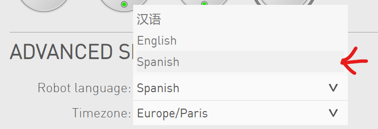

# Pepper Robot Scripts 🤖

Esta carpeta contiene los scripts que deben ejecutarse directamente en el robot Pepper para habilitar la interacción con IA.

## 📁 Archivos incluidos

-   **`server.py`** - Servidor HTTP que se ejecuta en el robot Pepper
-   **`ai_pepper_script.py`** - Script principal de interacción con IA
-   **`choice_script.py`** - Script para selección según parámetros
-   **`pepper_interact.py`** - Funciones de interacción con el robot

## 🚀 Instalación en Pepper

### 1. Transferir archivos

Todos estos archivos deben copiarse al robot Pepper en la misma carpeta (por ejemplo: `/home/nao/scripts/`).

### 2. Configurar autostart

Para que el servidor se ejecute automáticamente al iniciar el robot:

1. Edita el archivo de configuración:

    ```bash
    nano /home/nao/naoqi/preferences/autoload.ini
    ```

2. Añade la ruta completa al script `server.py`:

    ```ini
    [python]
    /home/nao/scripts/server.py
    ```

3. Reinicia el robot Pepper

## 🎯 Uso

### Desde la página web

Una vez configurado el autostart, puedes ejecutar `ai_pepper_script.py` desde la interfaz web. (dile a pepper 'enciende la pantalla' mientras tenga los ojos azules para que la muestre)

### Desde la terminal (Depuración y Ejecución Manual)

Para tareas de desarrollo o depuración, es recomendable ejecutar el sistema manualmente. Esto permite visualizar los `prints` del servidor y la salida del script de IA simultáneamente.

1.  **Acceder al robot:**
    Conéctate vía SSH: `ssh nao@<IP_DEL_ROBOT>` (Contraseña por defecto: `nao`).

2.  **Liberar el puerto:**
    Si el servidor ya está corriendo por el *autostart*, deberás detenerlo para lanzarlo manualmente:
    ```bash
    fuser -k 8080/tcp
    ```

3.  **Lanzar el Servidor Puente (Terminal 1):**
    ```bash
    cd /home/nao/pepper-chatbot/
    python server.py
    ```
    *Mantén esta terminal abierta para monitorizar la comunicación con el servidor GPU.*

4.  **Ejecutar el flujo (Terminal 2):**
    Abre una nueva conexión SSH y lanza la petición. El uso de comillas es importante para evitar errores con los parámetros de la URL:
    ```bash
    curl "http://localhost:8080/run-script?provider=openai"
    ```

### Funcionalidad del script

El script `ai_pepper_script.py` realiza las siguientes acciones:

1. **🎭 Selección de personalidad** - Si no se especifica por parámetro, pregunta qué personalidad quieres para la IA
2. **🤖 Proveedor de IA** - Permite elegir entre diferentes proveedores (Gemini, OpenAI, etc.)
3. **🎤 Grabación de audio** - Graba la pregunta del usuario en `test.wav`
4. **📤 Envío al servidor** - Transmite el archivo de audio al servidor de IA
5. **💬 Obtención de respuesta** - Realiza una llamada al endpoint para obtener la respuesta de la IA
6. **🔊 Reproducción** - El robot Pepper reproduce la respuesta usando text-to-speech

## ⚙️ Configuración

Asegúrate de que:

-   ✅ El robot Pepper esté conectado a la red
-   ✅ El servidor de IA esté accesible

---

💡 **Nota**: Este es el componente que se ejecuta en el robot Pepper. Para el servidor de IA y la configuración completa del proyecto, consulta el README principal.

## Errores

El principal error que existe ahora mismo es que al ejecutar el script `choice_script.py` (ya sea de forma individual o desde otro script) pepper deja de reconocer los comandos de voz, es decir, normalmente si le dices 'Hola pepper' o 'enciende la pantalla' te responde o muestra un web en la tablet pero en este estado simplemente reconoce los comandos, se pone los ojos en verde, pero no reacciona en absoluto.

Si el robot acaba en este estado la forma de que vuelva a funcionar correctamente es desde la página web seleccionando el idioma español de nuevo.


Según lo que he podido ver el error se origina en las lineas de codigo 122-123 de `choice_script.py` pero estas lineas son **necesarias** ya que sin ellas a partir de la segunda ejecución el script da el error `A grammar named "modifiable_grammar" already exists.`.

```
# Al cambiar el idioma, se reinicia el vocabulario por defecto.
self.asr.setLanguage("English")
self.asr.setLanguage("Spanish")
```

Dejo por [aqui](https://stackoverflow.com/q/79713027) la pregunta de stackoverflow que hice para solucionar el error del vocabulario.
